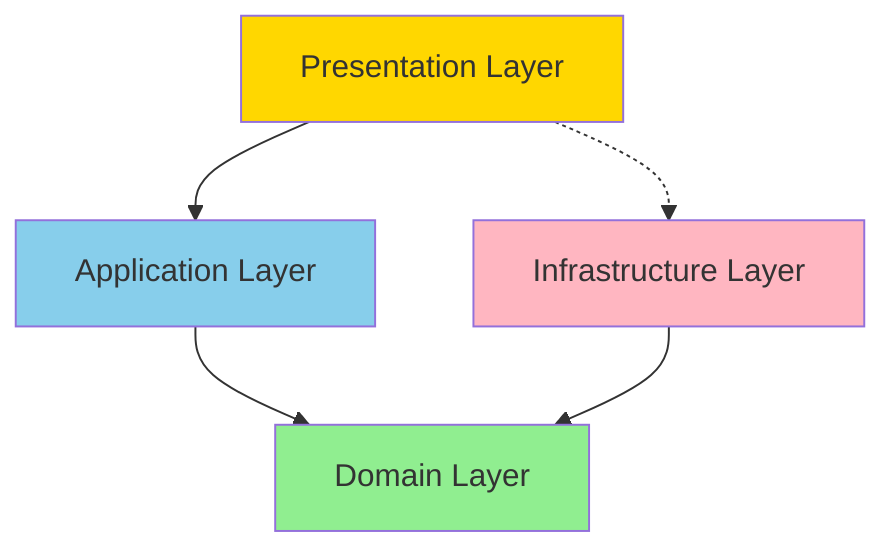
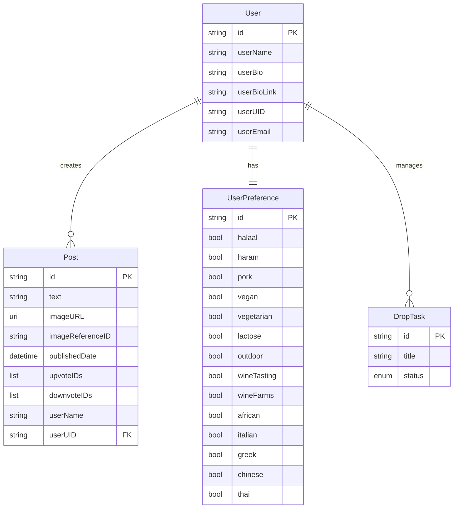
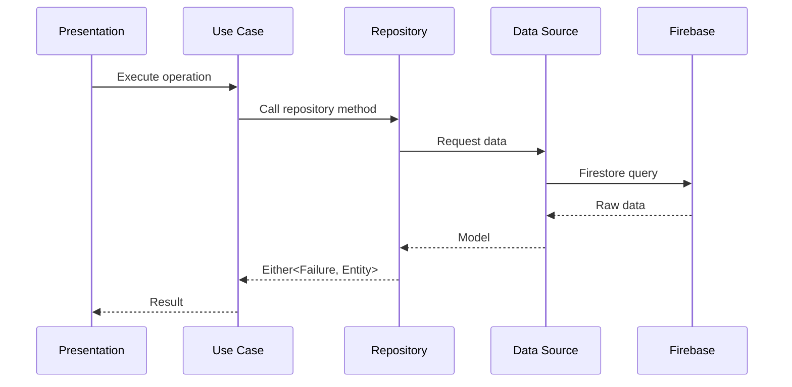

# Design Document

## Overview

This design document outlines the architecture and implementation approach for migrating the HoneyBird iOS application from Swift to Flutter using Domain-Driven Design (DDD) principles. The design establishes a clean, layered architecture that separates business logic from infrastructure concerns, ensuring maintainability, testability, and scalability.

The migration focuses on translating five core Swift models (User, Post, UserPreference, SideMenuTab, and DropTask) into a properly structured Flutter application following DDD patterns with clear boundaries between domain, application, infrastructure, and presentation layers.

## Architecture

### Layer Structure

The application follows a four-layer DDD architecture:

```
lib/
├── core/
│   ├── error/
│   │   └── failures.dart
│   ├── utils/
│   │   └── constants.dart
│   └── di/
│       └── injection.dart
├── domain/
│   ├── entities/
│   │   ├── user.dart
│   │   ├── post.dart
│   │   ├── user_preference.dart
│   │   ├── drop_task.dart
│   │   └── drop_status.dart
│   ├── repositories/
│   │   ├── user_repository.dart
│   │   ├── post_repository.dart
│   │   ├── user_preference_repository.dart
│   │   └── task_repository.dart
│   └── value_objects/
│       └── side_menu_tab.dart
├── application/
│   └── use_cases/
│       ├── user/
│       │   ├── get_user.dart
│       │   ├── create_user.dart
│       │   └── update_user.dart
│       ├── post/
│       │   ├── get_posts.dart
│       │   ├── create_post.dart
│       │   ├── upvote_post.dart
│       │   └── downvote_post.dart
│       ├── preferences/
│       │   ├── get_preferences.dart
│       │   └── save_preferences.dart
│       └── tasks/
│           ├── get_tasks.dart
│           ├── create_task.dart
│           └── update_task_status.dart
├── infrastructure/
│   ├── models/
│   │   ├── user_model.dart
│   │   ├── post_model.dart
│   │   ├── user_preference_model.dart
│   │   └── drop_task_model.dart
│   ├── repositories/
│   │   ├── user_repository_impl.dart
│   │   ├── post_repository_impl.dart
│   │   ├── user_preference_repository_impl.dart
│   │   └── task_repository_impl.dart
│   └── data_sources/
│       ├── firebase_user_data_source.dart
│       ├── firebase_post_data_source.dart
│       ├── local_preference_data_source.dart
│       └── local_task_data_source.dart
└── presentation/
    ├── screens/
    ├── widgets/
    └── state/
```

### Dependency Flow

Dependencies flow inward following the Dependency Inversion Principle:



- **Domain Layer** (green): Core business logic, no external dependencies
- **Application Layer** (blue): Use cases orchestrating domain operations
- **Infrastructure Layer** (pink): External concerns (Firebase, local storage)
- **Presentation Layer** (yellow): UI and state management

## Components and Interfaces

### Domain Layer Components

#### 1. User Entity

```dart
class User extends Equatable {
  final String? id;
  final String userName;
  final String userBio;
  final String userBioLink;
  final String userUID;
  final String userEmail;

  const User({
    this.id,
    required this.userName,
    required this.userBio,
    required this.userBioLink,
    required this.userUID,
    required this.userEmail,
  });

  @override
  List<Object?> get props => [id, userName, userBio, userBioLink, userUID, userEmail];
}
```

**Design Rationale**: Immutable entity with value equality for comparison. The id is nullable to support creation before persistence.

#### 2. Post Entity

```dart
class Post extends Equatable {
  final String? id;
  final String text;
  final Uri? imageURL;
  final String imageReferenceID;
  final DateTime publishedDate;
  final List<String> upvoteIDs;
  final List<String> downvoteIDs;
  final String userName;
  final String userUID;

  const Post({
    this.id,
    required this.text,
    this.imageURL,
    this.imageReferenceID = '',
    required this.publishedDate,
    this.upvoteIDs = const [],
    this.downvoteIDs = const [],
    required this.userName,
    required this.userUID,
  });

  @override
  List<Object?> get props => [
    id, text, imageURL, imageReferenceID, publishedDate,
    upvoteIDs, downvoteIDs, userName, userUID
  ];
}
```

**Design Rationale**: Uses Uri for type safety with URLs, DateTime for proper date handling, and const lists for immutability.

#### 3. UserPreference Entity

```dart
class UserPreference extends Equatable {
  final String id;
  final bool halaal;
  final bool haram;
  final bool pork;
  final bool vegan;
  final bool vegetarian;
  final bool lactose;
  final bool outdoor;
  final bool wineTasting;
  final bool wineFarms;
  final bool african;
  final bool italian;
  final bool greek;
  final bool chinese;
  final bool thai;

  const UserPreference({
    required this.id,
    this.halaal = false,
    this.haram = false,
    this.pork = false,
    this.vegan = false,
    this.vegetarian = false,
    this.lactose = false,
    this.outdoor = false,
    this.wineTasting = false,
    this.wineFarms = false,
    this.african = true,
    this.chinese = true,
    this.greek = true,
    this.italian = true,
    this.thai = true,
  });

  UserPreference copyWith({
    String? id,
    bool? halaal,
    bool? haram,
    // ... other parameters
  }) {
    return UserPreference(
      id: id ?? this.id,
      halaal: halaal ?? this.halaal,
      // ... other fields
    );
  }

  @override
  List<Object?> get props => [id, halaal, haram, pork, vegan, vegetarian, lactose,
    outdoor, wineTasting, wineFarms, african, italian, greek, chinese, thai];
}
```

**Design Rationale**: Immutable with copyWith for creating modified instances. Default values match Swift implementation.

#### 4. SideMenuTab Value Object

```dart
enum SideMenuTab {
  home('Home'),
  store('Store'),
  notifications('Notifications'),
  profile('Profile'),
  settings('Settings');

  final String displayName;
  const SideMenuTab(this.displayName);
}
```

**Design Rationale**: Enhanced enum with associated values for display names, matching Swift's raw value pattern.

#### 5. DropTask Entity and DropStatus

```dart
enum DropStatus {
  todo,
  working,
  completed;
}

class DropTask extends Equatable {
  final String id;
  final String title;
  final DropStatus status;

  const DropTask({
    required this.id,
    required this.title,
    required this.status,
  });

  @override
  List<Object?> get props => [id, title, status];
}
```

**Design Rationale**: Simple enum for status, immutable entity with UUID-based identification.

#### 6. Repository Interfaces

```dart
abstract class UserRepository {
  Future<Either<Failure, User>> getUser(String userId);
  Future<Either<Failure, User>> createUser(User user);
  Future<Either<Failure, User>> updateUser(User user);
  Future<Either<Failure, void>> deleteUser(String userId);
}

abstract class PostRepository {
  Future<Either<Failure, List<Post>>> getPosts();
  Future<Either<Failure, Post>> getPost(String postId);
  Future<Either<Failure, Post>> createPost(Post post);
  Future<Either<Failure, Post>> updatePost(Post post);
  Future<Either<Failure, void>> deletePost(String postId);
  Future<Either<Failure, Post>> upvotePost(String postId, String userId);
  Future<Either<Failure, Post>> downvotePost(String postId, String userId);
}

abstract class UserPreferenceRepository {
  Future<Either<Failure, UserPreference>> getPreferences(String userId);
  Future<Either<Failure, void>> savePreferences(UserPreference preferences);
}

abstract class TaskRepository {
  Future<Either<Failure, List<DropTask>>> getTasks();
  Future<Either<Failure, DropTask>> createTask(DropTask task);
  Future<Either<Failure, DropTask>> updateTask(DropTask task);
  Future<Either<Failure, void>> deleteTask(String taskId);
}
```

**Design Rationale**: Abstract interfaces using Either for functional error handling, returning domain entities, and using Future for async operations.

### Infrastructure Layer Components

#### 1. Models with Serialization

Infrastructure models extend domain entities and add serialization:

```dart
class UserModel extends User {
  const UserModel({
    super.id,
    required super.userName,
    required super.userBio,
    required super.userBioLink,
    required super.userUID,
    required super.userEmail,
  });

  factory UserModel.fromJson(Map<String, dynamic> json) {
    return UserModel(
      id: json['id'] as String?,
      userName: json['userName'] as String,
      userBio: json['userBio'] as String,
      userBioLink: json['userBioLink'] as String,
      userUID: json['userUID'] as String,
      userEmail: json['userEmail'] as String,
    );
  }

  Map<String, dynamic> toJson() {
    return {
      'id': id,
      'userName': userName,
      'userBio': userBio,
      'userBioLink': userBioLink,
      'userUID': userUID,
      'userEmail': userEmail,
    };
  }

  factory UserModel.fromEntity(User user) {
    return UserModel(
      id: user.id,
      userName: user.userName,
      userBio: user.userBio,
      userBioLink: user.userBioLink,
      userUID: user.userUID,
      userEmail: user.userEmail,
    );
  }
}
```

**Design Rationale**: Models extend entities to inherit domain logic while adding infrastructure concerns (serialization). Factory constructors enable conversion between layers.

#### 2. Data Sources

Data sources handle direct interaction with external systems:

```dart
abstract class FirebaseUserDataSource {
  Future<UserModel> getUser(String userId);
  Future<UserModel> createUser(UserModel user);
  Future<UserModel> updateUser(UserModel user);
  Future<void> deleteUser(String userId);
}

class FirebaseUserDataSourceImpl implements FirebaseUserDataSource {
  final FirebaseFirestore firestore;

  FirebaseUserDataSourceImpl({required this.firestore});

  @override
  Future<UserModel> getUser(String userId) async {
    final doc = await firestore.collection('users').doc(userId).get();
    if (!doc.exists) {
      throw ServerException('User not found');
    }
    return UserModel.fromJson(doc.data()!);
  }

  // ... other implementations
}
```

**Design Rationale**: Separate data source abstractions allow for easier testing and potential replacement of Firebase with other backends.

#### 3. Repository Implementations

```dart
class UserRepositoryImpl implements UserRepository {
  final FirebaseUserDataSource dataSource;

  UserRepositoryImpl({required this.dataSource});

  @override
  Future<Either<Failure, User>> getUser(String userId) async {
    try {
      final userModel = await dataSource.getUser(userId);
      return Right(userModel);
    } on ServerException catch (e) {
      return Left(ServerFailure(e.message));
    } catch (e) {
      return Left(ServerFailure('Unexpected error occurred'));
    }
  }

  // ... other implementations
}
```

**Design Rationale**: Repository implementations bridge infrastructure and domain, converting exceptions to Failures and models to entities.

### Application Layer Components

#### Use Cases

Use cases encapsulate single application operations:

```dart
class GetUser {
  final UserRepository repository;

  GetUser(this.repository);

  Future<Either<Failure, User>> call(String userId) {
    return repository.getUser(userId);
  }
}

class CreatePost {
  final PostRepository repository;

  CreatePost(this.repository);

  Future<Either<Failure, Post>> call(Post post) {
    return repository.createPost(post);
  }
}

class UpvotePost {
  final PostRepository repository;

  UpvotePost(this.repository);

  Future<Either<Failure, Post>> call(String postId, String userId) {
    return repository.upvotePost(postId, userId);
  }
}
```

**Design Rationale**: Single-responsibility use cases with call methods for clean invocation. Each use case depends only on repository interfaces from the domain layer.

## Data Models

### Entity Relationships



### Data Flow



## Error Handling

### Failure Hierarchy

```dart
abstract class Failure extends Equatable {
  final String message;
  
  const Failure(this.message);
  
  @override
  List<Object> get props => [message];
}

class ServerFailure extends Failure {
  const ServerFailure(super.message);
}

class CacheFailure extends Failure {
  const CacheFailure(super.message);
}

class ValidationFailure extends Failure {
  const ValidationFailure(super.message);
}

class NetworkFailure extends Failure {
  const NetworkFailure(super.message);
}
```

**Design Rationale**: Typed failures allow for specific error handling at the presentation layer. All failures are immutable and comparable.

### Error Conversion Strategy

Infrastructure exceptions are caught and converted to domain Failures:

- `FirebaseException` → `ServerFailure`
- `IOException` → `NetworkFailure`
- Local storage errors → `CacheFailure`
- Validation errors → `ValidationFailure`

## Testing Strategy

### Unit Testing

1. **Domain Layer**: Test entities for equality, immutability, and copyWith methods
2. **Use Cases**: Test with mock repositories to verify correct repository method calls
3. **Repository Implementations**: Test with mock data sources to verify error handling and model-entity conversion

### Integration Testing

1. **Data Sources**: Test Firebase integration with Firestore emulator
2. **Repository Flow**: Test complete data flow from repository through data source
3. **Use Case Flow**: Test complete application operations end-to-end

### Widget Testing

1. **Presentation Layer**: Test widgets with mock use cases
2. **State Management**: Test state transitions and UI updates

### Test Structure

```
test/
├── domain/
│   ├── entities/
│   └── repositories/
├── application/
│   └── use_cases/
├── infrastructure/
│   ├── models/
│   ├── repositories/
│   └── data_sources/
└── presentation/
    ├── screens/
    └── widgets/
```

## Dependency Injection Setup

### Configuration

Using `get_it` for dependency injection:

```dart
final sl = GetIt.instance;

Future<void> init() async {
  // External
  final firestore = FirebaseFirestore.instance;
  sl.registerLazySingleton(() => firestore);

  // Data sources
  sl.registerLazySingleton<FirebaseUserDataSource>(
    () => FirebaseUserDataSourceImpl(firestore: sl()),
  );
  sl.registerLazySingleton<FirebasePostDataSource>(
    () => FirebasePostDataSourceImpl(firestore: sl()),
  );
  sl.registerLazySingleton<LocalPreferenceDataSource>(
    () => LocalPreferenceDataSourceImpl(),
  );
  sl.registerLazySingleton<LocalTaskDataSource>(
    () => LocalTaskDataSourceImpl(),
  );

  // Repositories
  sl.registerLazySingleton<UserRepository>(
    () => UserRepositoryImpl(dataSource: sl()),
  );
  sl.registerLazySingleton<PostRepository>(
    () => PostRepositoryImpl(dataSource: sl()),
  );
  sl.registerLazySingleton<UserPreferenceRepository>(
    () => UserPreferenceRepositoryImpl(dataSource: sl()),
  );
  sl.registerLazySingleton<TaskRepository>(
    () => TaskRepositoryImpl(dataSource: sl()),
  );

  // Use cases
  sl.registerFactory(() => GetUser(sl()));
  sl.registerFactory(() => CreateUser(sl()));
  sl.registerFactory(() => UpdateUser(sl()));
  sl.registerFactory(() => GetPosts(sl()));
  sl.registerFactory(() => CreatePost(sl()));
  sl.registerFactory(() => UpvotePost(sl()));
  sl.registerFactory(() => DownvotePost(sl()));
  sl.registerFactory(() => GetPreferences(sl()));
  sl.registerFactory(() => SavePreferences(sl()));
  sl.registerFactory(() => GetTasks(sl()));
  sl.registerFactory(() => CreateTask(sl()));
  sl.registerFactory(() => UpdateTaskStatus(sl()));
}
```

**Design Rationale**: 
- External dependencies (Firebase) registered as lazy singletons
- Data sources and repositories as lazy singletons (stateless services)
- Use cases as factories (lightweight, created on demand)
- Clear dependency chain from external → data sources → repositories → use cases

## Package Dependencies

### Required Packages

```yaml
dependencies:
  # Core Flutter
  flutter:
    sdk: flutter
  
  # Functional programming
  dartz: ^0.10.1
  
  # Value equality
  equatable: ^2.0.5
  
  # Firebase
  firebase_core: ^2.24.2
  cloud_firestore: ^4.13.6
  
  # Dependency injection
  get_it: ^7.6.4
  
  # Local storage
  shared_preferences: ^2.2.2
  
  # UUID generation
  uuid: ^4.2.2

dev_dependencies:
  # Code generation
  freezed: ^2.4.5
  json_serializable: ^6.7.1
  build_runner: ^2.4.7
  
  # Testing
  mockito: ^5.4.4
  fake_cloud_firestore: ^2.4.9
```

**Design Rationale**: Minimal dependencies focused on DDD implementation, functional programming, and Firebase integration. Code generation tools for reducing boilerplate.

## Migration Path

### Phase 1: Foundation
1. Set up folder structure
2. Add dependencies
3. Configure dependency injection
4. Create base Failure classes

### Phase 2: Domain Layer
1. Create all entities
2. Create value objects
3. Define repository interfaces

### Phase 3: Infrastructure Layer
1. Create models with serialization
2. Implement data sources
3. Implement repositories

### Phase 4: Application Layer
1. Implement use cases for each operation
2. Wire up dependency injection

### Phase 5: Presentation Layer (Future)
1. Create screens and widgets
2. Implement state management
3. Connect UI to use cases

This design focuses on Phases 1-4, establishing the core DDD architecture with migrated models. The presentation layer will be implemented in subsequent iterations.
